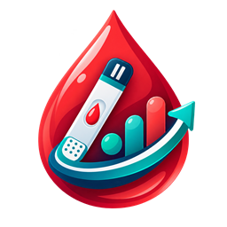

<div align="center">
  

  # Diabetes Predictor

  **A polished desktop interface for exploring a lightweight, dataset-derived diabetes risk indicator.**

  Built with Python and Tkinter—no third-party runtime packages required.
</div>

> [!IMPORTANT]
> This project is an educational demonstration. Its output is **not a medical diagnosis**, does not rule diabetes in or out, and should not be used to make health decisions. Consult a qualified clinician for medical testing and advice.

## Features

- Modern clinical dashboard with a responsive, scroll-safe layout
- Eight clearly labeled patient measurements with units
- Inline missing-value and numeric-input validation
- Human-readable lower/elevated indicator results
- Likelihood gauge and contextual explanation
- Custom diabetes-specific application icon
- Keyboard shortcuts for faster use
- Command-line fallback when the GUI module is unavailable
- Dependency-free runtime using the Python standard library

## Quick start

### Requirements

- Python 3.10 or newer
- Tkinter, normally included with standard Python installations

### Run the desktop app

```bash
python diabetes.py
```

The included sample row is loaded into the form so the interface can be explored immediately.

### Keyboard shortcuts

| Shortcut | Action |
| --- | --- |
| `Enter` | Analyze the current values |
| `Esc` | Clear the form and result |

## Measurements

The indicator accepts the following eight numeric values:

| Measurement | Unit shown in the app |
| --- | --- |
| Pregnancies | count |
| Glucose | mg/dL |
| Blood pressure | mm Hg |
| Skin thickness | mm |
| Insulin | µU/mL |
| Body mass index | kg/m² |
| Diabetes pedigree | score |
| Age | years |

## How the indicator works

At startup, the program reads `diabetes.csv`, computes per-feature statistics, and derives a simple weighted linear score. The dataset mean is placed at the decision threshold. The interface reports whether an entered row falls below or above that threshold and maps the distance from it to a smooth percentage.

This is a **heuristic**, not a trained or clinically validated machine-learning model. In particular:

- It does not learn from labeled diabetes outcomes.
- Its weights come from inverse feature ranges, not predictive importance.
- The displayed percentage is a confidence-like indicator, not a calibrated probability of diabetes.
- The source dataset determines the comparison baseline.

See [DOCUMENTATION.md](DOCUMENTATION.md) for the full implementation walkthrough.

## Project structure

```text
Diabetes Predictor/
├── assets/
│   ├── diabetes-predictor.png       # Full-resolution generated artwork
│   ├── diabetes-predictor-256.png   # App-ready PNG
│   └── diabetes-predictor.ico       # Windows application icon
├── tests/
│   └── test_diabetes_gui.py         # Validation and result-format tests
├── diabetes.csv                     # Runtime reference data
├── diabetes.py                      # Data pipeline and application entry point
├── diabetes_gui.py                  # Tkinter desktop interface
└── DOCUMENTATION.md                 # Technical documentation
```

## Run the tests

```bash
python -m unittest discover -v
```

## Design

The interface uses a restrained navy-and-teal clinical palette. The custom icon combines a blood droplet, glucose test strip, and rising analysis trend to reflect the app's purpose as a diabetes indicator rather than a general wellness tool.

The icon artwork was generated specifically for this project with OpenAI's built-in image-generation tool and then prepared locally as PNG and ICO assets.

## License

No license has been specified. Add one before redistributing or accepting external contributions.
